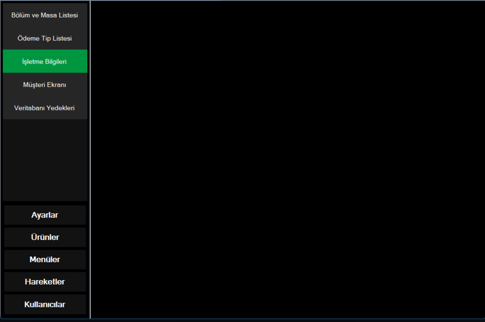

# Management-Menu

## About

This project is a detailed management menu developed using WinForms. It provides a comprehensive and user-friendly interface for managing various aspects of a system or application. 

## Screenshot


## Features

- **Detailed Menu Layout**: A well-organized menu layout for managing different functionalities.
- **User-Friendly Interface**: Intuitive interface for easy navigation and management.
- **Customizable Sections**: Ability to customize and add different menu items based on user needs.
- **WinForms Integration**: Built using Windows Forms for desktop application development.

## Technologies Used

- **C# WinForms**: Framework for creating the desktop application interface.
- **.NET Framework/Core**: Backend logic and operations.
- **Visual Studio**: Integrated development environment used for development.

## Installation

1. **Clone the Repository**:
    ```sh
    git clone https://github.com/BeratARPA/Management-Menu.git
    ```
2. **Open with Visual Studio**: Open the project in Visual Studio.
3. **Install Dependencies**: Ensure all necessary dependencies are resolved.
4. **Build the Project**: Build the solution to ensure proper setup.
5. **Run the Project**: Press F5 to run the project and view the menu interface.

## Usage

1. **Open the Application**: Launch the application from Visual Studio or the executable.
2. **Navigate the Menu**: Use the detailed menu to access various functionalities.
3. **Customize Menu**: Add or modify menu items according to your requirements.

## Contributing

If you would like to contribute, please fork the repository, create a feature branch, and submit a pull request.

## License

This project is licensed under the MIT License. See the [LICENSE](LICENSE) file for more details.

## Contact

For questions or feedback, feel free to contact me:
- **Email**: [beratarpa@hotmail.com](mailto:beratarpa@hotmail.com)
- **GitHub**: [https://github.com/BeratARPA](https://github.com/BeratARPA)
